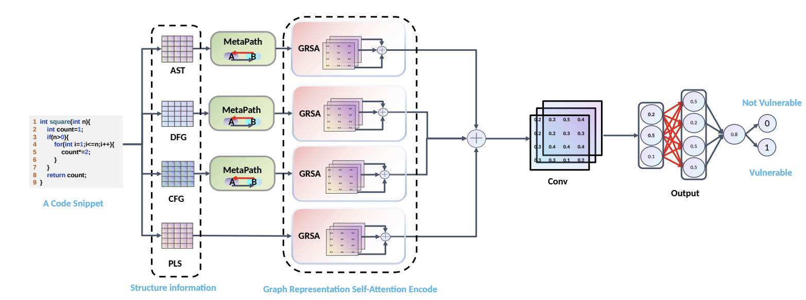

# DeepVulSeeker: A Novelty of Vulnerability Identification Framework via Code Graph Structure and Pre-training Mechanism
 DeepVulSeeker is a model based on a heterogeneous structural
information with MetaPaths, pre-trained semantic models, and Graph Representation Self-Attention (GRSA) Encoding network. DeepVulSeeker first captures the semantic information relationship between each programmatic node and its neighbors of a piece of code with the help of a multi-layer bidirectional Transformer based pre-trained model named UniXcoder model. UniXcoder can effectively encode the naturallanguages to program languages, providing more pertinent and precise semantic information for the training of our model.DeepVulSeeker then utilizes the semantic information to obtain the structural representations of the codes through Data Flow Graph (DFG), Control Flow Graph (CFG), and Abstract Syntax Tree (AST). In the end, DeepVulSeeker combines the
obtained semantic information and the structural information, and feeds them to a convolution network and a feed-forward network to predict whether a given code snippet is vulnerable. In a nutshell, DeepVulSeeker can not only learn the structural information of a program, but also can understand its semantic implications


## Topology


 ## Dataset
 All the processed *jsonl* files for the training set, validation set and test set are in [process/raw]() folder.
## Build and run
 ### build y


 ```python
 python3 build_y.py
 ```
 ### build ast
 ```python
run slice_raw.py
python3 build_dot.py
python3 build_ast.py
 ```

 ### build cfg and dfg
 ```python
python3 build_cfgdfg.py
 ```
 ### build pls
 #### get special words
 ```python
python3 Specialword.py
 ```
 ## train
In the root directory
 ```python
python3 train.py
 ```
 
